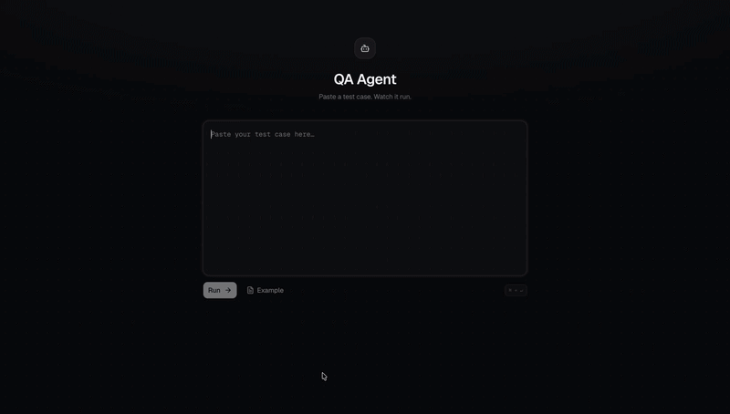

<h1 align="center">qpilot</h1>

<p align="center">
  <b>An AI agent that runs your manual test cases in a real browser.</b><br>
  Paste plain text. Watch it click.
</p>

<p align="center">
  <a href="https://www.npmjs.com/package/qpilot"></a>
  
  
  <a href="https://github.com/broxhq/qpilot"></a>
</p>

<p align="center">
  
</p>

```bash
npx qpilot
```

That's the whole install. First launch walks you through picking a model, then opens
the UI in your browser.

**Needs:** Node.js 20.12+, Google Chrome, and an [Anthropic API key](https://console.anthropic.com)
— or any OpenAI-compatible endpoint (Qwen, vLLM, Ollama, a corporate gateway).

## How it works

1. Paste a plain-text test case — the messy kind a PM writes in Confluence is fine.
2. The agent opens Chrome and executes each step.
3. Results stream in live: `pass`, `fail` or `warn` per step, with evidence quoted
   from the page and a screenshot on failure.
4. Hits an OTP or captcha? It pauses and asks you, then carries on.

There is no test code, no selectors and no config files. The agent reads the page
as an accessibility tree on every action, so nothing is stored that can go stale.

| | Manual testing | Scripted e2e | **qpilot** |
|---|---|---|---|
| To add a test | write the steps | write and maintain code | write the steps |
| Who can write it | anyone | someone who codes | anyone |
| After a redesign | a human adapts | update the test code | nothing to update |
| OTP / captcha | handled by the human | usually blocks the run | pauses and asks you |
| Output | you watched it | pass/fail | pass/fail/warn per step + evidence |

## Writing a test case

```
TC-001 — Login and add item to cart
URL: https://www.saucedemo.com/
Credentials: standard_user / secret_sauce

Steps:
1. Open the home page.
   Expected: login form with Username and Password fields is visible.

2. Enter credentials and click Login.
   Expected: Products page opens with 6 items.

3. Click "Add to cart" on "Sauce Labs Backpack".
   Expected: cart counter shows 1.
```

No format is required — headings, numbering and "Expected:" lines are all optional.
The clearer the expected result, the stricter the check. Paste several test cases
at once and the agent runs them in order, grouped in the UI.

## Attachments

Some steps need a file: an avatar to upload, a CSV to import, a PDF to attach.
Click **Attach files** before running, and the agent can hand them to any upload
control on the page — including the hidden `<input type=file>` behind a styled
"Choose file" button.

Files live only for the duration of the run and are deleted when it ends. The agent
can upload them, but never sees what is inside them.

## A folder of test cases

**Choose folder** points qpilot at a directory of `.md` files. Tick the ones you
want and run them as a batch — one after another, with live status and timing, and
a **Stop** button. Finished runs land under **Recent runs**.

## Models

```bash
npx qpilot config
```

- **Anthropic (Claude)** — paste your `sk-ant-…` key. Defaults to `claude-haiku-4-5`.
  A base URL is optional, for reaching Claude through a corporate proxy.
- **Custom** — any OpenAI-compatible endpoint. Give it a base URL, token and model id:

  ```
  Base URL: https://dashscope-intl.aliyuncs.com/compatible-mode/v1
  Model id: qwen2.5-72b-instruct
  ```

  The model must support tool calling — that is how the agent drives the browser.

Your choice is saved to `~/.qpilot/config.json` (mode `600`). For the Anthropic
provider you can skip setup entirely with an `ANTHROPIC_API_KEY` env var or a
`.env.local` file.

## Good to know

- Everything runs locally. Nothing leaves your machine except the model calls, so
  qpilot works against staging and internal networks.
- Browser visibility is per run: **Run** stays headless, **Run with preview** lets
  you watch Chrome work.
- Runs are held in memory, last 50 only — restarting the server clears them.
- A genuinely broken page still fails the run. That is the point.

## Contributing

Issues and pull requests are welcome — see [CONTRIBUTING.md](CONTRIBUTING.md).

---

<p align="center">
  Built with <a href="https://www.anthropic.com">Claude</a> and <a href="https://playwright.dev">Playwright</a>.<br>
  If qpilot saved you time, a <a href="https://github.com/broxhq/qpilot">⭐ on GitHub</a> helps more than you'd think.
</p>
